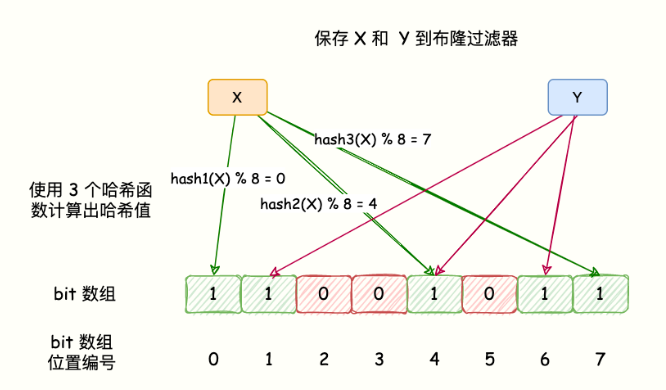

布隆过滤器 判断数据如果存在那么可能存在，如果不存在，那么就一定不存在
hash 表也能用于元素是否在集合中的判断，但是布隆过滤器只需要hash表的 1/8 或者 1/4 

BloomFilter 的算法是，首先分配一块内存空间做 bit 数组，数组的 bit 位初始值全部设为 0。
 

元素越多，会导致误报率增高

redis6.0 可以集成布隆过滤器

https://mp.weixin.qq.com/s/0tpiecFnbcJ6TgeuTrbX8w
redisbloom
https://github.com/RedisBloom/RedisBloom/releases/tag/v2.2.14
创建布隆过滤器时需要传入 错误率和容量两个参数，默认 0.1 错误率越低，其所需要的空间就越大

