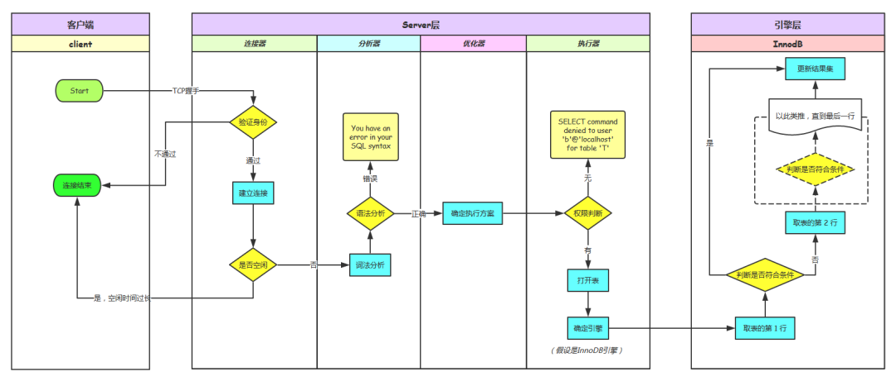
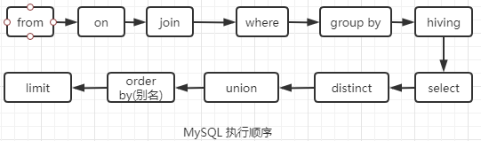
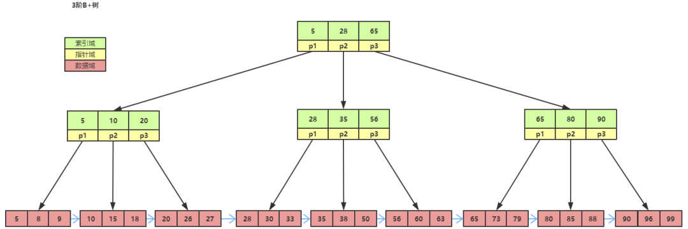
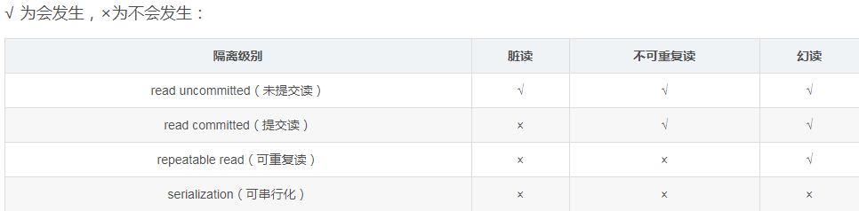
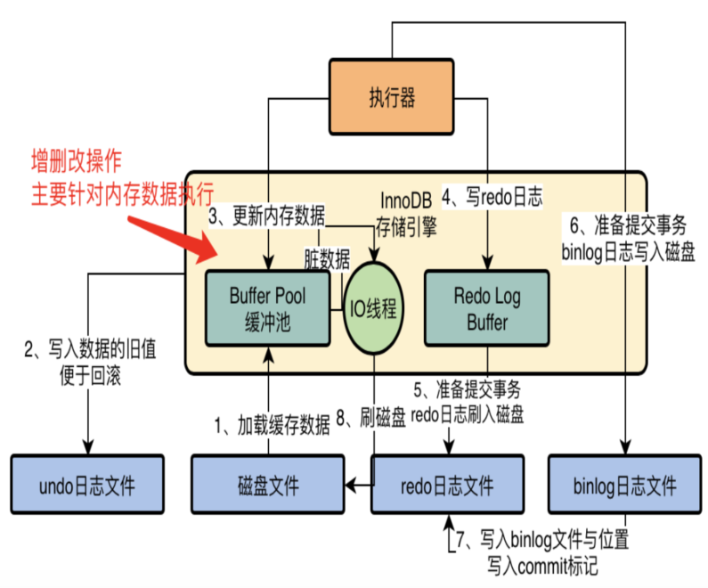
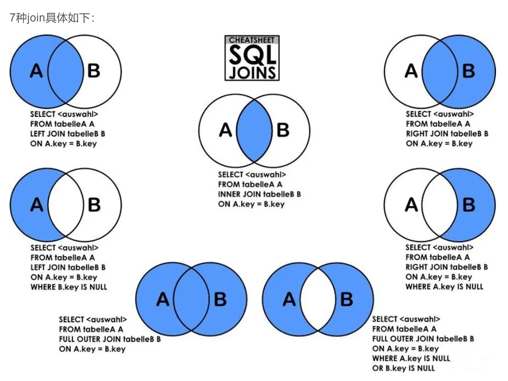
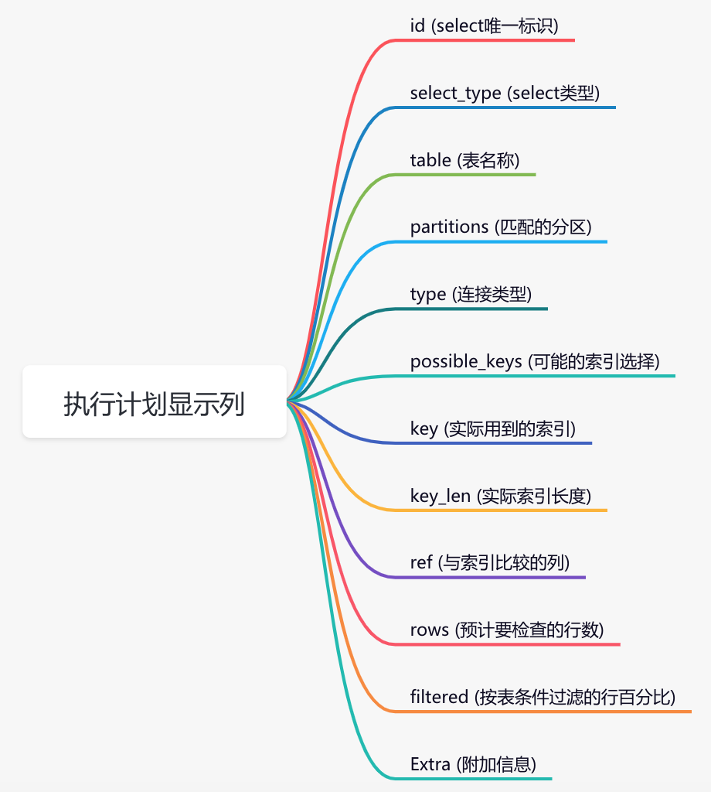

https://blog.csdn.net/zdplife/article/details/90106518
https://mp.weixin.qq.com/s/JDXGOseJoDwYxMTd7RGnrA

表空间
InnoDB 所有数据都存放在一个空间中，称之为表空间，表空间由段，区，页组成。
innodb_file_per_table 参数：
InnoDB 默认情况下所有表的数据都存放在共享表空间 ibdata1 中，该参数决定了是否每为张表内的数据单独设置一个表空间。
如果开启该功能，单独表空间中只存放数据、索引、插入缓存 Bitmap 页，其它数据包括回滚信息，插入缓存索引页，系统事务信息等还是存放在原来
的共享表空间中。

段 区 页 行

段(索引段、数据段、回滚段)
表空间由各个段组成，主要分为索引段，数据段以及回滚段。其中数据段存放在 B+ 树的叶子节点，索引段存放在 B+ 树的非叶子节点。

区(区是由连续的页组成的,固定大小1MB)
区由连续的页组成：
每个区的大小是固定的：1MB
默认页的大小是 16KB，所以一个区中有 64 个连续页。
innodb_page_size 参数，在 1.2.x 版本以后可以设置对页的大小进行设置。
当创建一个表时，并不是直接使用连续的 64 个页存放数据，而是先用每个段开始时的 32 个碎片页来存放数据，等使用完这些碎片页才开始申请 64
 个连续页，这样做的主要目的对于一些小表，刚开始可以申请较少的空间，节省磁盘容量的开销。

页(默认大小16kb)
InnoDB 存储引擎中，常见的页的类型有：

数据和索引页
undo 页
系统页
事务数据页
插入缓存 Bitmap 页
插入缓存空闲列表页
未压缩的二进制大对象页
压缩的二进制大对象页

行
InnoDB 存储引擎中，数据是按照行进行存放的，最多可以存放 7992 条行记录

sql 查询按照自定义顺序进行排序,如果不在记录中则排序在最前面
select * from tab_name order by field(field_name, str1, str2, str3)

执行计划 extra 
Using where; Using temporary; Using filesort

mysql 基本架构图
缓存 缓存查询结果
sql 语句和结果以键值对方式存储，缓存频繁失效标更新会导致缓存失效 命中率比较低

连接器 管理连接验证权限
show processlist 查看现在的链接，wait_timeout 默认8个小时
show variables like 'wait_timeout'; 查询链接等待时间

分析器 词法分析、语法分析


优化器 执行计划索引选择
选择索引 多变关联决定关联顺序
rbo 基于规则优化 cbo 基于成本优化

执行器 操作引擎返回结果

存储引擎 存储数据，提供读写接口 

redo log 数据修改先更新redo log 并更新内存， innodb 引擎会在适合时机记录到磁盘
redo log 有固定大小，循环写数据 

undo log 是为了实现事务的原子性， undo log 实现 mvcc undo log 也是逻辑日志
在执行任何数据之前，先需要进行数据备份，然后进行修改，如果执行错误需要 rollback 

bin log 是 server 层日志
1 redo log 是innodb 特有的，bin log 是所有引擎都可以用的
2 redo log 是物理日志，记录了数据页的修改 而bin log 是逻辑日志，记录语句的原始逻辑
3 redo log 是循环写的，空间会用完 而 bin log 是可以追加的，不会产生覆盖

bin log 会记录所有的逻辑操作，追加的方式写入，一般用于全量备份

create/alter table 以及 insert/update/delete 的二进制日志，主从数据库同步用到的都是binlog

statement 模式

只记录引起数据库变更的sql 语句，该模式性能最优，没有记录实际的数据，所以日志量日志量和 IO 都消耗很低，性能是最优的。但是如果使用 
uuid 和 now 等函数，结果不确定。

row 模式

会记录每一行的操作记录，可以绝对精准的还原，从而保证了数据的安全与可靠，并且复制和数据恢复过程可以是并发进行的，缺点是binlog 日志体积大。性能消耗较多。

mixed 模式

前两中的混合模式，大多数情况下使用statement,不确定结果的时候使用row 模式。

relay log   sql thread 


redo log 两阶段提交
先写 redo log 再写 bin log 
先写 bin log 再写 redo log 


repeat('b',1024*1024*5) 重复函数 
select @@max_allowed_packet;

max_allowed_packet控制communication buffer最大尺寸，当发送的数据包大小超过该值就会报错，我们都知道，MySQL包括Server层和存储引擎，
它们之间遵循2PC协议，Server层主要处理用户的请求：连接请求—>SQL语法分析—>语义检查—>生成执行计划—>执行计划—>fetch data；
存储引擎层主要存储数据，提供数据读写接口。

show profiles;
show profile cpu,block io for query 1;  
mysql.slow_log记录的是执行超过long_query_time的所有SQL，如果遵循MySQL开发规范，slow query不会太多，
但是开启了log_queries_not_using_indexes=ON就会有好多full table scan的SQL被记录，这时slow_log表会很大，对于RDS来说，一般只保留一天的数据，
在频繁insert into slow_log的时候，做truncate table slow_log去清理slow_log会导致MDL，影响MySQL稳定性。
建议将log_output=FILE，开启slow_log， audit_log，这样就会将slow_log，audit_log写入文件，
通过Go API处理这些文件将数据写入分布式列式数据库clickhouse中做统计分析。

由于MySQL是单进程多线程模型，一个SQL语句无法利用多个cpu core去执行，这也就决定了MySQL比较适合OLTP（特点：大量用户访问、逻辑读，索引扫描，
返回少量数据，SQL简单）业务系统，同时要针对MySQL去制定一些建模规范和开发规范，尽量避免使用Text类型，它不但消耗大量的网络和IO带宽，
同时在该表上的DML操作都会变得很慢。另外建议将复杂的统计分析类的SQL，建议迁移到实时数仓OLAP中，例如目前使用比较多的clickhouse，
里云的ADB，AWS的Redshift都可以，
做到OLTP和OLAP类业务SQL分离，保证业务系统的稳定性。

id_log_file_0 
write pos 是当前记录的位置，一边写一遍后移，是一个循环的写入的过程
checkpoint 是当前要擦除的位置，也是不断往后推移并且循环的，擦除记录前需要将记录更新到数据文件中
write pos 和 checkpoint 之前是可以写的部分，保存新的记录操作，如果 write pos 追上了 checkpoint 那么表示空间满了，
不能继续执行更新操作 需要等待checkpoint 擦除一些记录然后才能写入

数据库发生一次，之前提交的记录不会丢失，这个能力称之为 crash-safe 



mysql sql 执行顺序



```
查看 binlog 的日志模式 
show global variables like "%binlog_format%"; 
log-bin = /data/3306/mysql-bin  
binlog_format="STATEMENT"  
#binlog_format="ROW"  
#binlog_format="MIXED" 

```

1 数据库开启主从同步流程时，主节点需要开启二进制日志，记录任何修改了数据库的事件
2 从节点开始一个线程(I/O thread ) 使用mysql 协议请求二进制日志文件的事件
3 主节点启动一个线程(dump thread),检查自己二进制日志时间，跟对方请求的位置对比，增量发送，如果没有位置参数，则发送所有时间给从节点
4 从节点接收到主节点的数据后放置到中继日志里(relay log)中，并记录该次主节点的二进制日志文件文职
5 从节点启动一个(sql thread),把relay log 的时间读取出来,在本地执行一次。

mysql 的复制方式是异步的，并且具有并行复制能力，
全量同步复制和半同步复制
全量同步 所有的日志全部同步至从库才算成功
半同步   从库写入日志成功后返回ack给主库，主库至少收到一个才算成功
主备切换 可靠性优先还是可用性优先

mysql 中的索引常见模型为 哈希表、有序数组、搜索树
哈希表：一种以KV存储数据的结构，只适合等值查询，不适合范围查询。
有序数组：只适用于静态存储引擎，涉及到插入的时候比较麻烦。可以参考Java中的ArrayList。
搜索树：按照数据结构中的二叉树来存储数据，不过此时是N叉树(B+树)。广泛应用在存储引擎层中。

搜索树的结构


1 B+ 树非叶子节点存储的只是索引，可以存储的更多。B+树比B树更加矮胖，IO次数更少。
2 B+ 树叶子节点前后管理，更加方便范围查询。同时结果都在叶子节点，查询效率稳定。
3 B+ 树中更有利于对数据扫描，可以避免B树的回溯扫描。
回表的概念

索引的优点：
1、唯一索引可以保证每一行数据的唯一性 
2、提高查询速度 
3、加速表与表的连接 
4、显著的减少查询中分组和排序的时间
5、通过使用索引，可以在查询的过程中，使用优化隐藏器，提高系统的性能。
索引的缺点：
1、创建跟维护都需要耗时 
2、创建索引时，需要对表加锁，在锁表的同时，可能会影响到其他的数据操作 
3、 索引需要磁盘的空间进行存储，磁盘占用也很快。
4、当对表中的数据进行CRUD的时，也会触发索引的维护，而维护索引需要时间，可能会降低数据操作性能
索引设计的原则不应该：
1、索引不是越多越好。索引太多，维护索引需要时间跟空间。
2、频繁更新的数据，不宜建索引。
3、数据量小的表没必要建立索引。
应该：
1、重复率小的列建议生成索引。因为重复数据少，索引树查询更有效率，等价基数越大越好。
2、数据具有唯一性，建议生成唯一性索引。在数据库的层面，保证数据正确性 
3、频繁group by、order by的列建议生成索引。可以大幅提高分组和排序效率 
4、经常用于查询条件的字段建议生成索引。通过索引查询，速度更快

时间 空间 成本

索引失效的场景
1、模糊搜索：左模糊或全模糊都会导致索引失效，比如'%a'和'%a%'。但是右模糊是可以利用索引的，比如'a%' 。
2、隐式类型转换：比如select * from t where name = xxx , name是字符串类型，但是没有加引号，所以是由MySQL隐式转换的，所以会让索引失效 
3、当语句中带有or的时候：比如select * from t where name=‘sw’ or age=14
4、不符合联合索引的最左前缀匹配：(A,B,C)的联合索引，你只where了C或B或只有B,C

关于索引的知识点：
1 主键索引：主键索引的叶子节点存的是整行数据信息。在InnoDB里，主键索引也被称为聚簇索引（clustered index）。主键自增是无法保证完全
自增的哦，遇到唯一键冲突、事务回滚等都可能导致不连续。
2 唯一索引：以唯一列生成的索引，该列不允许有重复值，但允许有空值(NULL)
3 普通索引跟唯一索引查询性能：InnoDB 的数据是按数据页为单位来读写的，默认每页16KB，因此这两种索引查询数据性能差别微乎其微。
4 change buffer：普通索引用在更新过程的加速，更新的字段如果在缓存中，如果是普通索引则直接更新即可。如果是唯一索引需要将所有数据读入内
存来确保不违背唯一性，所以尽量用普通索引。
5 非主键索引：非主键索引的叶子节点内容是主键的值。在InnoDB里，非主键索引也被称为二级索引（secondary index）
6 回表：先通过数据库索引扫描出数据所在的行，再通过行主键id取出索引中未提供的数据，即基于非主键索引的查询需要多扫描一棵索引树。
7 覆盖索引：如果一个索引包含（或者说覆盖）所有需要查询的字段的值，我们就称之为覆盖索引。
8 联合索引：相对单列索引，组合索引是用多个列组合构建的索引，一次性最多联合16个。
9 最左前缀原则：对多个字段同时建立的组合索引(有顺序，ABC，ACB是完全不同的两种联合索引) 以联合索引(a,b,c)为例，建立这样的索引相当于建
立了索引a、ab、abc三个索引。另外组合索引实际还是一个索引，并非真的创建了多个索引，只是产生的效果等价于产生多个索引。
10 索引下推：MySQL 5.6引入了索引下推优化，可以在索引遍历过程中，对索引中包含的字段先做判断，过滤掉不符合条件的记录，减少回表字数。
11 索引维护：B+树为了维护索引有序性涉及到页分裂跟页合并。增删数据时需考虑页空间利用率。
12 自增主键：一般会建立与业务无关的自增主键，不会触发叶子节点分裂。
13 延迟关联：通过使用覆盖索引查询返回需要的主键，再根据主键关联原表获得需要的数据。
14 InnoDB存储: * .frm文件是一份定义文件，也就是定义数据库表是一张怎么样的表。*.ibd文件则是该表的索引，数据存储文件，既该表的所有索引树
，所有行记录数据都存储在该文件中。
15 MyISAM存储：* .frm文件是一份定义文件，也就是定义数据库表是一张怎么样的表。* .MYD文件是MyISAM存储引擎表的所有行数据的文件。* .MYI
文件存放的是MyISAM存储引擎表的索引相关数据的文件。MyISAM引擎下，表数据和表索引数据是分开存储的。
16 MyISAM查询：在MyISAM下，主键索引和辅助键索引都属于非聚簇索引。查询不管是走主键索引，还是非主键索引，在叶子结点得到的都是目的数据的
地址，还需要通过该地址，才能在数据文件中找到目的数据。
PS：InnoDB支持聚簇索引，MyISAM不支持聚簇索引

ACID的四个特性
1 原子性（Atomicity）：把多个操作放到一个事务中，保证这些操作要么都成功，要么都不成功
2 一致性（Consistency）：理解成一串对数据进行操作的程序执行下来，不会对数据产生不好的影响，比如凭空产生，或消失
3 隔离性（Isolation，又称独立性）：隔离性的意思就是多个事务之间互相不干扰，即使是并发事务的情况下，他们只是两个并发执行没有交集，互
不影响的东西；当然实现中，也不一定需要这么完整隔离性，即不一定需要这么的互不干扰，有时候还是允许有部分干扰的。所以MySQL可以支持4种事务隔离性
4 持久性（Durability）：当某个操作操作完毕了，那么结果就是这样了，并且这个操作会持久化到日志记录中

事务操作可能会出现的数据问题
1、脏读(dirty read)：B事务更改数据还未提交，A事务已经看到并且用了。B事务如果回滚，则A事务做错了 
2、 不可重复读(non-repeatable read)：不可重复读的重点是修改: 同样的条件, 你读取过的数据, 再次读取出来发现值不一样了，只需要锁住
满足条件的记录 
3、 幻读(phantom read)：事务A先修改了某个表的所有纪录的状态字段为已处理，未提交；事务B也在此时新增了一条未处理的记录，并提交了；
事务A随后查询记录，却发现有一条记录是未处理的造成幻读现象，幻读仅专指新插入的行。幻读会造成语义上的问题跟数据一致性问题。
4、 在可重复读RR隔离级别下，普通查询是快照读，是不会看到别的事务插入的数据的。因此，幻读在当前读下才会出现。要用间隙锁解决此问题。

innodb 行记录格式 row_format 
show table status like 'table_name'
MySQL数据库varcahr类型的最大长度限制为 65535
一个数据页存放的数据越多，效率越高 多出 786 的字节存储在溢出页中存储

SQL标准的事务隔离级别由低到高如下：



`读未提交RU`：别人改数据的事务尚未提交，我在我的事务中也能读到。
`读已提交RC(Oracle默认)`：别人改数据的事务已经提交，我在我的事务中才能读到。
`可重复读RR(MySQL默认)`：别人改数据的事务已经提交，我在我的事务中也不去读，以此保证重复读一致性。
`串行SE`：我的事务尚未提交，别人就别想改数据。

mysql 中的悲观锁和乐观锁时一下设计思想。

表锁和行锁

表级锁、页级锁、行级锁。

MyISAM存储引擎**只支持表锁**。

innodb 中的锁

```
共享锁和排他锁 (Shared and Exclusive Locks)
意向锁（Intention Locks） 
记录锁（Record Locks） 
间隙锁（Gap Locks） 
临键锁 （Next-Key Locks） 
插入意向锁（Insert Intention Locks） 
主键自增锁 (AUTO-INC Locks) 
空间索引断言锁（Predicate Locks for Spatial Indexes）

lock in share mode 
for update 

mvcc 读当前 读快照 

重建表 alter table tab_name engine = InnoDB


```


SQL优化主要分4个方向：`SQL语句跟索引`、`表结构`、`系统配置`、`硬件`。

总优化思路就是**最大化利用索引**、**尽可能避免全表扫描**、**减少无效数据的查询**：

```
1、减少数据访问：设置合理的字段类型，启用压缩，通过索引访问等减少磁盘 IO。
2、返回更少的数据：只返回需要的字段和数据分页处理，减少磁盘 IO 及网络 IO。
3、减少交互次数：批量 DML 操作，函数存储等减少数据连接次数。
4、减少服务器 CPU 开销：尽量减少数据库排序操作以及全表查询，减少 CPU 内存占用 。
5、分表分区：使用表分区，可以增加并行操作，更大限度利用 CPU 资源。
```

###### mvcc 实现原理
MVCC实现原理主要是依赖记录中的 四个隐式字段、undo日志 、Consistent Read View来实现的。

```
1、全称Multi-Version Concurrency Control，即多版本并发控制。MVCC是一种并发控制的理念，维持一个数据的多个版本，使得读写操作没有冲突。
2、MVCC在MySQL InnoDB中实现目的主要是为了提高数据库并发性能，用更好的方式去处理读-写冲突，做到即使有读写冲突时，也能做到不加锁，非阻塞并发读。

读当前
select lock in share mode 
select for update 
update 
insert 
delete 

读快照

MVCC实现原理主要是依赖记录中的 四个隐式字段、undo日志 、Consistent Read View来实现的。
4个隐藏字段 事务id、回滚指针、隐藏id、删除标记
1 DB_TRX_ID：
6byte，最近修改(修改/插入)事务ID：记录创建这条记录/最后一次修改该记录的事务ID
2 DB_ROLL_PTR
7byte，回滚指针，指向这条记录的上一个版本（存储于rollback segment里）
3 DB_ROW_ID
6byte，隐含的自增ID（隐藏主键），如果数据表没有主键，InnoDB会自动以DB_ROW_ID产生一个聚簇索引
4 FLAG
一个删除flag隐藏字段, 既记录被更新或删除并不代表真的删除，而是删除flag变了

事务对一条记录的修改，会导致该记录的undo log成为一条记录版本线性表(链表)，undo log的链首就是最新的旧记录，链尾就是最早的旧记录

undo日志：此知识点上文已经说过了，对MVCC有帮助的实质是update undo log，undo log实际上就是存在rollback segment中旧记录链。

一致读视图 Consistent Read View：Read View是事务进行快照读操作的时候生产的读视图(Read View)，在该事务执行的快照读的那一刻，会生成
数据库系统当前的一个快照，记录并维护系统当前活跃事务的ID(InnoDB里面每个事务有一个唯一的事务ID，叫作transaction id。它是在事务开始的
时候向InnoDB的事务系统申请的，是按申请顺序严格递增的)。拿着这个ID跟记录中ID对比进行选择性展示，这里说下大致的思维。
你可以简单的理解为MVCC为每一行增加了两个隐藏字段，两个字段分别保存了这个行的当前事务ID跟行的删除事务ID。

1 insert 
InnoDB为新插入的每一行保存当前系统版本号作为版本号。
2 select 
1、innoDB只会查找版本早于当前事务版本的数据行(也就是行的系统版本号<=事务的系统版本号)，这样可以确保事务读取的行，要么是在事务开始
前已经存在的，要么是事务自身插入或者修改过的。
2、行的删除版本要么未定义，要么大于当前事务版本号，这可以确保事务读取到的行在事务开始之前未被删除。
3、只有1，2 同时满足的记录，才能返回作为查询结果。
3 delete时：
InnoDB会为删除的每一行保存当前系统的版本号(事务的ID)作为删除标识.
4 update时：
InnoDB执行update，实际上是新插入了一行记录，并保存其创建时间为当前事务的ID，同时保存当前事务ID到要update的行的删除时间。


```



应用系统分层架构，为了加速数据访问，会把最常访问的数据，放在缓存(cache)里，避免每次都去访问数据库。操作系统，会有缓冲池(buffer pool)
机制，避免每次访问磁盘，以加速数据的访问。MySQL作为一个存储系统，同样具有缓冲池(buffer pool)机制，以避免每次查询数据都进行磁盘IO，
主要作用：

```
1、存在的意义是加速查询 
2、缓冲池(buffer pool) 是一种常见的降低磁盘访问 的机制；
3、缓冲池通常以页(page 16K)为单位缓存数据；
4、缓冲池的常见管理算法是LRU，memcache，OS，InnoDB都使用了这种算法；
5、InnoDB对普通LRU进行了优化：将缓冲池分为老生代和新生代，入缓冲池的页，优先进入老生代，该页被访问，才进入新生代，以解决预读失效的问
题页被访问。且在老生代停留时间超过配置阈值的，才进入新生代，以解决批量数据访问，大量热数据淘汰的问题


```

sql join 



1、MyISAM模式下把一个表的总行数存在了磁盘上，直接拿来用即可 
2、InnoDB引擎由于 MVCC的原因，需要把数据读出来然后累计求和 
3、性能来说 由好到坏：count(字段) < count(主键id) < count(1) ≈ count(*)，尽量用count(*)。


随机查询 
 select word from words order by rand() limit 3;
 
直接使用order by rand()，explain 这个语句发现需要 Using temporary和 Using filesort，查询的执行代价往往是比较大的。
所以在设计的时要避开这种写法。


###### exist 和 in 的对比

1、in查询时首先查询子查询的表，然后将内表和外表做一个笛卡尔积，然后按照条件进行筛选。
2、子查询使用 exists，会先进行主查询，将查询到的每行数据循环带入子查询校验是否存在，过滤出整体的返回数据。
3、两表大小相当，in 和 exists 差别不大。内表大，用 exists 效率较高；内表小，用 in 效率较高。
4、查询用not in 那么内外表都进行全表扫描，没有用到索引；而not extsts 的子查询依然能用到表上的索引。not exists都比not in要快。


##### mysql 优化

SQL优化主要分4个方向：SQL语句跟索引、表结构、系统配置、硬件。
总优化思路就是最大化利用索引、尽可能避免全表扫描、减少无效数据的查询：
1、减少数据访问：设置合理的字段类型，启用压缩，通过索引访问等减少磁盘 IO。
2、返回更少的数据：只返回需要的字段和数据分页处理，减少磁盘 IO 及网络 IO。
3、减少交互次数：批量 DML 操作，函数存储等减少数据连接次数。
4、减少服务器 CPU 开销：尽量减少数据库排序操作以及全表查询，减少 CPU 内存占用 。
5、分表分区：使用表分区，可以增加并行操作，更大限度利用 CPU 资源。
SQL语句优化大致举例：
1、合理建立覆盖索引：可以有效减少回表。
2、union，or，in都能命中索引，建议使用in 
3、负向条件(!=、<>、not in、not exists、not like 等) 索引不会使用索引，建议用in。
4、在列上进行运算或使用函数会使索引失效，从而进行全表扫描 
5、小心隐式类型转换，原字符串用整型会触发CAST函数导致索引失效。原int用字符串则会走索引。
6、不建议使用%前缀模糊查询。
7、多表关联查询时，小表在前，大表在后。在 MySQL 中，执行 from 后的表关联查询是从左往右执行的(Oracle 相反)，第一张表会涉及到全表扫描。
8、调整 Where 字句中的连接顺序，MySQL 采用从左往右，自上而下的顺序解析 where 子句。根据这个原理，应将过滤数据多的条件往前放，
最快速度缩小结果集。

SQL调优大致思路：
1、先用慢查询日志定位具体需要优化的sql 
2、使用 explain 执行计划查看索引使用情况 
3、重点关注(一般情况下根据这4列就能找到索引问题)：
1、key（查看有没有使用索引） 
2、key_len（查看索引使用是否充分）
3、type（查看索引类型） 
4、Extra（查看附加信息：排序、临时表、where条件为false等）

执行计划显示列


###### 表结构优化：
1、尽量使用TINYINT、SMALLINT、MEDIUM_INT作为整数类型而非INT，如果非负则加上UNSIGNED 。
2、VARCHAR的长度只分配真正需要的空间 。
3、尽量使用TIMESTAMP而非DATETIME 。
4、单表不要有太多字段，建议在20以内。
5、避免使用NULL字段，很难查询优化且占用额外索引空间。字符串默认为''。

###### 读写分离：
只在主服务器上写，只在从服务器上读。对应到数据库集群一般都是一主一从、一主多从。业务服务器把需要写的操作都写到主数据库中，读的操作
都去从库查询。主库会同步数据到从库保证数据的一致性。一般 读写分离 的实现方式有两种：代码封装跟数据库中间件。

###### 分库分表：分库分表分为垂直和水平两个方式，一般是先垂直后水平。
1、垂直分库：将应用分为若干模块，比如订单模块、用户模块、商品模块、支付模块等等。其实就是微服务的理念。
2、垂直分表：一般将不常用字段跟数据较大的字段做拆分。
3、水平分表：根据场景选择什么字段作分表字段，比如淘宝日订单1000万，用userId作分表字段，数据查询支持到最近6个月的订单，超过6个月的做
归档处理，那么6个月的数据量就是18亿，分1024张表，每个表存200W数据，hash(userId)%100找到对应表格。
4、ID生成器：分布式ID 需要跨库全局唯一方便查询存储-检索数据，确保唯一性跟数字递增性。

目前主要流行的分库分表工具 就是Mycat和sharding-sphere。

TiDB：开源分布式数据库，结合了传统的 RDBMS 和NoSQL 的最佳特性。TiDB 兼容 MySQL，支持无限的水平扩展，具备强一致性和高可用性。
TiDB 的目标是为 OLTP(Online Transactional Processing) 和 OLAP (Online Analytical Processing) 场景提供一站式的解决方案。
TiDB 具备如下核心特点
1、支持 MySQL 协议（开发接入成本低）。
2、100% 支持事务（数据一致性实现简单、可靠）。
3、无限水平拓展（不必考虑分库分表），不停服务。
4、TiDB 支持和 MySQL 的互备。
5、遵循jdbc原则，学习成本低，强关系型，强一致性，不用担心主从配置，不用考虑分库分表，还可以无缝动态扩展。


###### 索引的优缺点
优点：
1.大大加快数据的查询速度
2.唯一索引可以保证数据库表每一行的唯一性
3.加速表连接时间
缺点：
1.创建、维护索引要耗费时间，所以，索引数量不能过多。
2.索引是一种数据结构，会占据磁盘空间。
3.对表进行更新操作时，索引也要动态维护，降低了维护速度

###### 索引的类型
索引的数据结构 数组、hash表、搜索树
哈希索引
哈希表，也称散列表，主要设计思想是通过一个哈希函数， 把关键码映射的位置去寻找存放值的地方 ，读取的时候也是直接通过关键码来找到位置并
存进去，这种数据结构的平均查找复杂度为O(1)。
这种索引结构优点在于随机添加或删除单个元素的效率高，缺点在于哈希表中的元素并不一定按顺序排列，所以如果想做区间查询的话是很慢的，
hash 索引适合用于等值查询。
有序数组索引
有序数组索引在等值查询和区间查询场景中的效率都很高，还是拿上面的图做例子，用有序数组实现的话是这样子的：
有序数组的缺点也很明显，就跟ArrayList一样，虽然搜索快，但添加删除元素都有可能要移动后面所有的元素，这是数组的天然缺陷。所以，有序数组
索引只适用于静态存储引擎，

搜索树索引
说到搜索树，我们最熟悉的应该就是二叉搜索树了，二叉搜索树的特点是每个结点的左儿子小于父结点，父结点又小于右儿子，
并且左右子树也分别为二叉搜索树，平均时间复杂度是O(log2(n))。

###### B+树的特点是：
所有的叶子结点中包含了全部元素的信息，及指向含这些元素记录的指针，且叶子结点本身依关键字的大小自小而大顺序链接。
所有的中间结点元素都同时存在于子结点，在子结点元素中是最大（或最小）元素。
这种结构有两个优点：
可以使得单一结点存储更多的元素，除了叶子结点，其他的结点只是包含了键，没有保存值，这样的话，树的高度就能有效降低，从而减少查询的IO次数；
同时，因为叶子结点包含了下个叶子结点的指针，所以范围查询的时候如果搜索到第一个叶子结点的话，就能根据指针指向查询后面的数据，
不用再从根结点遍历了。
这也是为什么很多大神建议表的主键设计成自增长的好，因为这样范围查询能提高效率
###### 索引的分类
按照结构来分的话，数据库索引可以分为聚簇索引和非聚簇索引。
聚簇索引，也叫聚集索引，也是主键索引。就是按照每张表的主键构造一颗B+树，同时叶子结点中存放的就是整张表的行记录数据，简单点说，
就是我们常说的主键索引。在聚簇索引之上创建的索引称之为辅助索引，辅助索引访问数据总是需要二次查找。
非聚簇索引，也叫非聚集索引，二级索引。这种索引是将数据与索引分开存储，索引结构的叶子结点指向了数据对应的位置。


普通索引 唯一索引 全文索引 联合索引 
索引失效 
列上进行函数计算、存在null值的条件、类型转换、not 条件


redolog 是物理日志,因为数据都是在数据页的,记录的是数据页的变更
binlog 是逻辑日志,简单理解为sql语句

redo log落盘时机由innodb_flush_log_at_trx_commit控制
innodb_flush_log_at_trx_commit=0:不写入磁盘
innodb_flush_log_at_trx_commit=1:写入磁盘
innodb_flush_log_at_trx_commit=2:写入os cache,1s后写入磁盘

binlog落盘时机由sync_binlog控制
sync_binlog=0:写入os cache
sync_binlog=1:写入磁盘
sync_binlog=N:N个事务后写入磁盘

1 从磁盘文件加载数据到 buffer pool 缓冲池
2 undo log file 写入旧值用于回滚数据
3 执行器 buffer pool 中更新内存数据
4 执行器 写入 redo log buffer 
5 准备提交事务， redo log 写磁盘
6 准备提交事务，bin log 写入磁盘
7 redo log 写入本次 bin log 位置，添加 commit 标记
8
9 后台 io 线程随机刷脏数据页到磁盘文件

