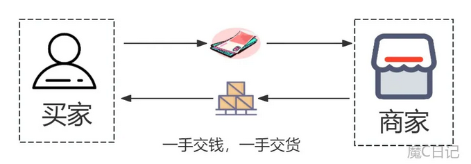

### 支付业务

时代的发展，移动互联网的普及，**微信**和**支付宝**已成为我们日常生活中**最常用**的**支付工具**，无论是吃喝玩乐，还是出行，或者叫个外卖，微信和支付宝都能搞定。**手机支付**，就像是空气一样，渗透到人们生活的方方面面，大大小小的经济行为都离不开支付。

而支付方式，古往今来，不断的发展，也在不断的进步。有些小伙伴可能听过“**第三方支付**”这个概念，那么什么是“**第四方支付**”？

#### 1 现金支付

第一方支付：即**现金支付**。

这是商品经济出现以来，最传统的支付方式，买家与卖家之间，直接以现金（纸币或硬币）交易，所谓一手交钱，一手交货。

这时支付的参与方，只是“**买家****自己**”，因此叫“**第一方支付”**。如下图

然而，“**现金支付**”它自身的特点，在某些场合存在一定的**弊端**，如交易过程肉眼**很难辨别**对方纸币的**真假**，随身**携带**大量的**现金**出门**不安全**等，逐渐被年轻一代的消费群体给疏远。

手机前的你，还记得自己上一次使用现金支付是在什么时候吗？

#### 2 二方支付

第二方支付：古代的钱庄，柜坊，银票，飞钱，现在的银行，银行卡。

买家没带现金，交易通过**银行卡**实现转账或付款，这时支付的参与方，除了买家自己外，还有“**银行**”，我们叫“**第二方支付**”。如下图

**银行卡交易**在一定程度解决了现金支付的一些弊端，但也存在一些“**局限性**”，如银行卡交易**终端普及率不高**（不是所有的商店都支持刷卡），限定消费者需指定场所才能消费，导致它曾经风靡一段时间，逐渐被时代给疏远。

#### 3 三方支付

第三方支付：日常生活中使用的微信支付或支付宝等。

买家使用手机打开微信或支付宝，通过扫第三方平台（微信或支付宝）提供的收款二维码完成扫码付款。

由于买家没有付现金，是通过微信或支付宝**第三方平台**来完成**付款**的，而微信钱包或支付宝余额里面的钱源头是从银行卡账户充值进去的。这时支付参与方是：买家，银行，“**支付公司**”，因此叫“**第三方支付**”。如下图

有些伙伴会提出疑问，除银行外随便一家“非金融机构”都可以做第三方支付吗？答案是否定的。

非金融机构要从事金融服务，需要持有人民银行颁发的《支付业务许可证》即我们常说的“**支付牌照**”，否则属于非法经营。

央行2010年制定的《非金融机构支付服务管理办法》指出：非金融机构提供支付服务，应当依据本办法规定取得《支付业务许可证》，成为支付机构，支付机构接受**中国人民银行**的**监督管理**，未经中国人民银行批准，任何非金融机构和个人不得从事或变相从事支付业务。

微信、支付宝，是第一批获得央行支付牌照的企业，且从事互联网支付较早，已被我们广大用户所熟知。

但第三方支付并不是只有微信、支付宝两家。跟微信支付、支付宝一样拥有支付牌照的第三方平台还有很多，如银联云闪付、京东金融、百度钱包等，这些第三方支付平台提供差异化的产品，应用于不同的行业与场景，共同维持着支付的生态圈。

随着“手机支付”在市场的广泛使用，建立在微信、支付宝等这些第三方支付平台之上的“**聚合支付**”应运而生。它以**高效**、**便捷**的特点，受到越来越多的商家和消费者的青睐。

#### 4 四方支付

第四方支付：“聚合支付服务商”提供的支付服务。

聚合支付相当于机构**集成多个三方支付接口**，开放给商家和个人。对商家来说提高了收款的便捷性，对买家来说，不用再考虑选择使用微信还是支付宝付款。

这时的支付参与方是：买家+银行+支付公司+**聚合支付服务商**（收单外包服务商）

聚合支付被称为是“**第四方支付**”。如下图

聚合支付为商家对接支付宝、微信等**多个渠道**，收款时，通过聚合支付二维码，或其他收银工具（如扫码盒子、扫码枪）**自动**识别买家付款码来源，**匹配**对应的支付渠道。

我们举个通俗易懂的例子。

假设支付宝是条蓝色水管，微信支付是条绿色水管，商家使用“聚合支付”，相当于让这两条水管往自己的蓄水池里灌水，也就是通过支付宝和微信支付来收款。蓝色水管和绿色水管都往蓄水池里灌水，到晚上商家要盘点当天的营业收入时，需要分别对蓝色水管和绿色水管的蓄水量进行盘点。

而聚合支付的作用就在于，它把两个水管的通道聚合成了一个水管，蓝色水管和绿色水管的水会流通到一个水管，而这个聚合水管会识别水是从蓝色水管进来的，还是从绿色水管进来的。

对于商家来说，可以直接了解当天的接水量是多少，而且也可以实时了解水都是从哪个水管里进来的，商家不需要再区分水的来源。

前面我们提到，非金融第三方机构需要从事金融服务，需持有支付牌照，那么作为建立在第三方支付平台之上的**聚合支付服务商**，第四方支付是否也需要支付牌照？

根据中国支付清算协会2020年发布《收单外包服务机构备案管理办法（试行）》规定，包括聚合支付在内的收单外包服务开启备案制。

因此，我们不难得出，有中国支付清算协会的收单外包服务机构备案，且“**业务类型**”是聚合支付技术服务，所提供的支付服务才能算是合法的第四方支付。

当前市场上，从事聚合支付的服务商分为两类：“**收单机构**”（银行或持牌第三方，如美团、拉卡拉等）和“**收单外包服务商**”（代理商或第四方，如收钱吧、汇来米等）

我们的生活离不开支付，那么如何从手机支付的交易订单中判断该笔交易是否是“聚合支付”？

不管买家是“付款码支付”还是主动“扫码支付”，每一笔支付都会推送一个交易凭证，微信或支付宝查看支付后的“**账单详情**”，如果详情里面有显示“**清算机构**”，说明该笔交易走得是“聚合支付”。

同时，从显示的“**收单机构名称**”，我们也可以知道该笔交易的支付接口是哪个“第三方支付公司”提供的。如下图
